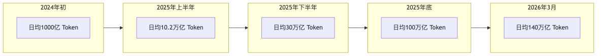
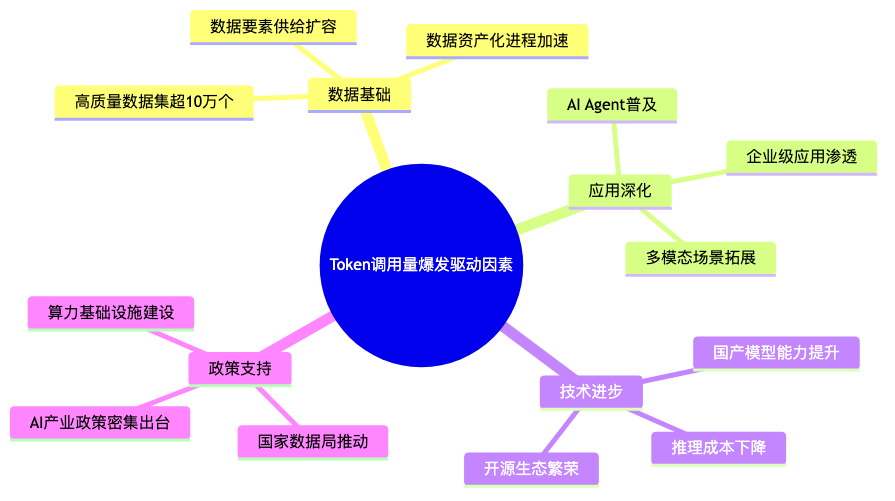
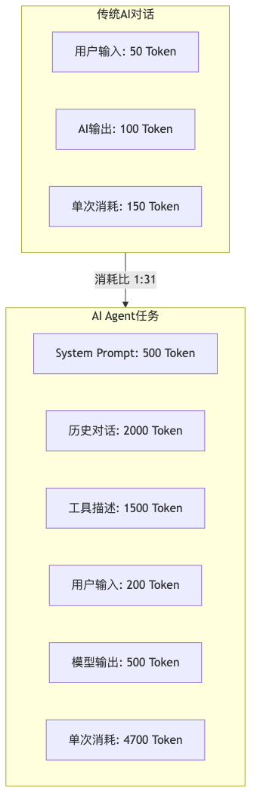
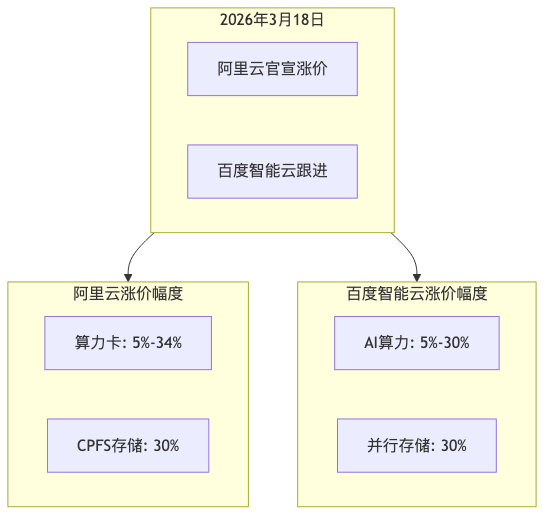
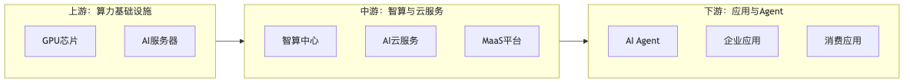

# Token调用量爆发深度研究报告

> **报告生成时间：** 2026年3月30日

---

## 目录

- 执行摘要
- 一、Token调用量爆发全景
- 二、核心驱动因素分析
- 三、OpenClaw与AI Agent浪潮
- 四、云服务市场变革
- 五、产业链投资机遇
- 六、风险因素分析
- 七、研究结论与展望
- 八、信息来源

---

## 执行摘要

2026年，中国AI Token调用量迎来历史性爆发。国家数据局数据显示，截至2026年3月，中国日均AI Token调用量已突破**140万亿**，较2024年初增长超过**1400倍**。

与此同时，「Token」一词的百度搜索量较去年日均搜索量暴增**1850%**，反映出市场对AI产业的关注度达到前所未有的高度。

### 核心数据一览

| 指标 | 数值 | 对比数据 |
| --- | --- | --- |
| 中国日均Token调用量 | 140万亿 | 较2024年初增长1400倍 |
| Token搜索量增幅 | 1850% | 较去年日均搜索量 |
| 中国模型周调用量 | 5.16万亿 | 首次超越美国 |
| OpenRouter平台周调用量 | 20.4万亿 | 环比增长20.7% |
| 云服务涨价幅度 | 最高34% | 阿里云、百度智能云 |

---

## 一、Token调用量爆发全景

### 1.1 增长轨迹

| 时间节点 | 日均Token调用量 | 增长倍数 |
| --- | --- | --- |
| 2024年初 | 约1000亿 | 基准 |
| 2025年上半年 | 10.2万亿 | 10倍 |
| 2025年下半年 | 30万亿→37万亿 | 30倍 |
| 2025年底 | 100万亿 | 100倍 |
| 2026年3月 | 140万亿 | 1400倍 |

### 1.2 关键里程碑

| 时间节点 | 事件 | 意义 |
| --- | --- | --- |
| 2024年初 | 日均约1000亿Token | 起步阶段 |
| 2025年6月 | 突破30万亿 | 应用普及期 |
| 2025年底 | 达到100万亿 | 规模化商用前夜 |
| 2026年2月 | 中国首超美国 | 历史性节点 |
| 2026年3月 | 突破140万亿 | 进入爆发期 |

### 1.3 中美对比

| 维度 | 中国 | 美国 | 评价 |
| --- | --- | --- | --- |
| 周调用量（2026.2.16-22） | 5.16万亿 | 2.7万亿 | **中国领先91%** |
| 全球Top5模型占比 | 4席 | 1席 | 中国占优 |
| 增长速度 | 三周增127% | 相对平稳 | 中国加速 |
| 海外调用量周环比 | +56% | — | 中国模型出海加速 |

---

## 二、核心驱动因素分析

### 2.1 数据要素支撑

**四大驱动因素**：

| 驱动因素 | 具体表现 |
| --- | --- |
| **数据基础** | 高质量数据集超10万个，数据要素供给扩容 |
| **应用深化** | AI Agent普及，企业级应用渗透，多模态场景拓展 |
| **技术进步** | 国产模型能力提升，推理成本下降，开源生态繁荣 |
| **政策支持** | 国家数据局推动，AI产业政策密集出台 |

### 2.2 企业级应用爆发

| 指标 | 数据 | 说明 |
| --- | --- | --- |
| 企业级日均调用量 | 37万亿Token | 2025年下半年 |
| 增长幅度 | +263% | 较上半年10.2万亿 |
| 企业AI投入意愿 | 96% | 未来12个月继续增加 |
| 预期正向回报 | 93% | 受访企业预期 |

**主要应用场景**：

- 金融：风险评估、智能投顾、合规审查
- 制造：智能质检、供应链优化、预测性维护
- 政务：智能客服、政策解读、数据分析
- 医疗：辅助诊断、病历分析、药物研发

### 2.3 国产模型崛起

全球调用量排名前五的模型中，**中国占据四席**：

| 排名 | 模型 | 厂商 | 国家 |
| ---: | --- | --- | --- |
| 1 | M2.5 | MiniMax | 中国 |
| 2 | Kimi K2.5 | 月之暗面 | 中国 |
| 3 | GLM-5 | 智谱AI | 中国 |
| 4 | V3.2 | DeepSeek | 中国 |
| 5 | — | — | 美国 |

---

## 三、OpenClaw与AI Agent浪潮

### 3.1 OpenClaw简介

| 维度 | 信息 |
| --- | --- |
| 产品名称 | OpenClaw（小龙虾） |
| 曾用名 | Clawdbot、Moltbot |
| 产品定位 | 开源、本地优先的AI Agent框架 |
| 核心能力 | 跨平台任务执行、多轮自我修正、庞大上下文 |
| GitHub发布 | 2025年11月 |

### 3.2 Token消耗特征

**关键发现**：

| 对比维度 | 传统AI对话 | AI Agent任务 | 消耗比 |
| --- | --- | --- | --- |
| 用户输入 | 50 Token | 200 Token | 4:1 |
| 系统提示词 | — | 500 Token | — |
| 历史对话 | — | 2000 Token | — |
| 工具描述 | — | 1500 Token | — |
| 模型输出 | 100 Token | 500 Token | 5:1 |
| **单次总消耗** | **150 Token** | **4700 Token** | **1:31** |

**行业影响**：

- AI Agent单次任务Token消耗是传统对话的**30倍以上**
- OpenClaw多轮自我修正机制导致Token消耗**指数级增长**
- OpenRouter平台接近**1/4的Token消耗由OpenClaw贡献**

### 3.3 云服务商响应

| 云服务商 | 产品/服务 | 特点 |
| --- | --- | --- |
| 腾讯云 | 轻量应用服务器 | 99元/年部署OpenClaw |
| 火山引擎 | ArkClaw | 开箱即用，零门槛养虾 |
| 天翼云 | 云主机部署方案 | 自定义配置版 |
| AWS Lightsail | OpenClaw部署方案 | 海外用户友好 |

---

## 四、云服务市场变革

### 4.1 涨价潮来袭

**2026年3月18日，行业迎来历史性涨价**：

| 云服务商 | 涨价产品 | 涨价幅度 | 生效时间 |
| --- | --- | --- | --- |
| **阿里云** | 算力卡（平头哥真武810E） | 5%-34% | 2026.4.18 |
| **阿里云** | CPFS存储（智算版） | 30% | 2026.4.18 |
| **百度智能云** | AI算力相关产品 | 5%-30% | 2026.4.18 |
| **百度智能云** | 并行文件存储 | 30% | 2026.4.18 |

### 4.2 涨价原因分析

| 原因 | 具体表现 |
| --- | --- |
| **需求爆发** | 全球AI需求大增，Token调用量暴涨 |
| **供应链涨价** | 核心硬件采购成本显著上涨 |
| **硬件成本** | DDR5内存现货价较2024年上涨731% |
| **商业模式转变** | AI算力从"包场"到"按需付费" |

### 4.3 行业影响

**利好方**：

- 云服务商：议价权提升，利润空间扩大
- 算力租赁商：需求激增，产能满载
- AI芯片厂商：订单增加，产能扩张

**承压方**：

- 中小企业：AI应用成本大幅上升
- 开发者：部署和维护成本增加
- 创业公司：部分被迫暂停AI项目

---

## 五、产业链投资机遇

### 5.1 Token经济产业链全景

**产业链三大环节**：

| 环节 | 核心组成 | 代表企业 |
| --- | --- | --- |
| **上游：算力基础设施** | GPU芯片、AI服务器 | 英伟达、华为昇腾、寒武纪、戴尔、联想、浪潮 |
| **中游：智算与云服务** | 智算中心、AI云、MaaS平台 | 阿里云、百度云、腾讯云、通义千问、豆包、文心 |
| **下游：应用与Agent** | AI Agent、企业应用、消费应用 | OpenClaw、智能体、金融/制造/医疗应用 |

### 5.2 受益环节分析

| 环节 | 受益逻辑 | 代表企业 |
| --- | --- | --- |
| **算力租赁** | 需求激增、价格上涨 | 算想科技、优刻得 |
| **AIDC** | Token工厂核心载体 | 数据中心运营商 |
| **AI芯片** | 底层硬件需求 | 英伟达、华为昇腾、寒武纪 |
| **云服务** | 量价齐升 | 阿里云、百度智能云、腾讯云 |
| **国产模型** | 高性价比替代 | MiniMax、智谱AI、DeepSeek |

### 5.3 市场预测

| 指标 | 预测值 | 来源 |
| --- | --- | --- |
| 中国AI云市场年复合增长率 | 72% | 摩根士丹利 |
| 2026年AI加速芯片市场规模 | 3813.9亿元 | 行业预测 |
| Token消耗年复合增长率（2025-2030） | 3418% | IDC |
| 中国AI推理Token消耗量（2030年） | 3900千万亿 | 摩根大通 |

---

## 六、风险因素分析

### 6.1 行业风险

| 风险类型 | 具体表现 | 影响程度 |
| --- | --- | ---: |
| **算力瓶颈** | 硬件产能有限，供需失衡 | ⭐⭐⭐ 高 |
| **成本压力** | 中小企业AI应用成本大幅上升 | ⭐⭐⭐ 高 |
| **技术迭代** | 新架构可能改变Token消耗模式 | ⭐⭐ 中 |
| **竞争加剧** | 国产模型与国际巨头竞争 | ⭐⭐ 中 |

### 6.2 公司特有风险

| 风险类型 | 具体表现 |
| --- | --- |
| **依赖云厂商** | 价格波动直接影响成本 |
| **技术路线** | Agent架构变化可能影响Token消耗 |
| **合规风险** | 数据安全和隐私保护要求提升 |
| **人才竞争** | AI人才短缺，人力成本上升 |

---

## 七、研究结论与展望

### 7.1 核心发现

**1. 历史性突破**

中国日均Token调用量突破140万亿，较2024年初增长1400倍，标志着中国AI产业从应用普及期加速迈向规模化商用阶段。

**2. 中国模型首超美国**

2026年2月，中国AI模型周调用量首次超越美国，且全球Top5中占据四席，反映出国产大模型的技术实力和市场认可度大幅提升。

**3. AI Agent成为核心驱动力**

OpenClaw等AI Agent产品的爆发，将单次任务Token消耗提升至传统对话的30倍以上，成为Token调用量指数级增长的核心引擎。

**4. 云服务商业模式重构**

阿里云、百度智能云等头部厂商相继涨价，标志着AI算力从"流量"向"燃料"转变，Token成为AI时代的新大宗商品。

### 7.2 投资建议

| 投资方向 | 逻辑 | 关注度 |
| --- | --- | ---: |
| 算力租赁 | 需求激增，涨价预期 | ⭐⭐⭐ |
| AIDC/数据中心 | Token工厂核心载体 | ⭐⭐⭐ |
| 国产AI芯片 | 自主可控+需求爆发 | ⭐⭐⭐ |
| 云服务商 | 量价齐升，议价权提升 | ⭐⭐ |
| AI Agent应用 | 场景落地加速 | ⭐⭐ |

---

## 八、信息来源

### 官方数据

- 国家数据局公开数据
- OpenRouter平台数据
- 阿里云、百度智能云官方公告

### 机构研究

- 国海证券研究报告
- 国泰君安证券研究
- 摩根大通预测数据
- IDC行业预测

### 新闻资讯

- 搜狐、今日头条、新浪财经
- 中国证券报、财联社
- 36氪、IT之家

---

> **免责声明**：本报告仅供参考，不构成投资建议。投资者应独立判断，自行承担投资风险。
