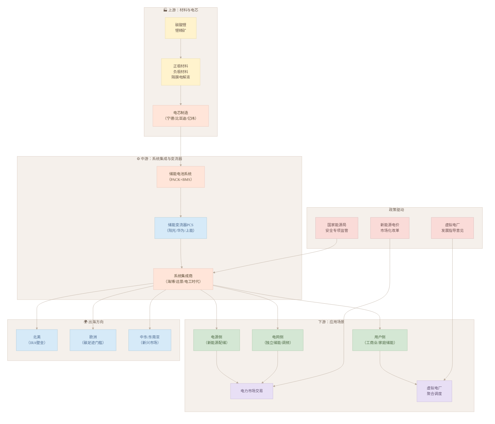

# 储能行业深度产研报告

> 数据来源：CNESA、EESA、中电联等机构最新统计，上市公司公告，北极星储能网、国际储能网等媒体报道。信息截止日期：2026年4月11日。

---

## 一、核心观点

2024年是中国新型储能真正爆发的年份。累计装机突破78 GW，同比翻番增长126%，在规模上首次压过抽水蓄能。碳酸锂价格从2022年高点60万元/吨跌到当前的14-15万元/吨，跌幅超过75%，原材料成本压力大幅缓解，这是装机爆发的底层原因之一。

但问题也摆到了台面上。2024年储能事故率比2023年高了12%，热失控是主要元凶。国家能源局3月发文，第一次把电化学储能安全监管列为专项任务，行业"野蛮生长"的阶段基本结束了。与此同时，比亚迪、阿特斯这些头部企业在海外大单不断，但北美IRA法案、欧洲碳足迹门槛都在筑墙，出海不是躺赢。

技术端，磷酸铁锂是绝对主力，钠离子和液流电池已经从示范走向工程化应用，构网型储能成了电网侧项目的标配技术。固态电池在储能场景还是期货，2026-2027年能不能量产都是未知数。

---

## 二、市场规模与增速

### 2.1 全球与中国：都在狂奔

CNESA DataLink 的数据，截至2024年底：

| 指标 | 2024年数据 | 同比 |
|------|-----------|------|
| 全球储能累计装机 | 372.0 GW | +28.6% |
| 全球新型储能累计 | 165.4 GW（首次突破百吉瓦） | +81.1% |
| 中国储能累计装机 | 137.9 GW | +59.9% |
| 中国新型储能累计 | 78.3 GW / 184.2 GWh | +126.5% / +147.5% |
| 中国新型储能年新增 | 42.5 GW / 107.1 GWh | +109.5% |

中国新型储能累计装机在全球的占比约47%，接近半壁江山。

EESA 预计2025年全球新增装机265.1 GWh，同比再增41%。CNESA 对中国2025年的预测更乐观，新增装机有望超过30 GW，"十四五"期间年复合增速超过100%。

### 2.2 大型化趋势

2024年12月单月新增13.0 GW / 34.1 GWh，环比增长316%，这个数字创了历史纪录。全年百兆瓦级项目投运180余个，同比增加67%。新增投运电站中，10万千瓦以上的占74.16%——换句话说，小项目越来越少，大站才是主流。

内蒙古2024年成为全国首个装机突破1000万千瓦的省份，新疆能量规模排第一，山东、江苏、河北紧随其后。西北、华北、华东是三大集中区域，这些地方新能源多、电网调峰压力大，项目落地快。

---

## 三、产业链价格跟踪

### 3.1 碳酸锂：跌完了，现在低位震荡

电池级碳酸锂当前约14万-15万元/吨（2026年3月报价）。2022年的高点是60万元/吨，现在只剩四分之一。对集成商来说，这是好事——成本下来了，项目经济性改善，装机自然就上来了。

### 3.2 储能系统价格：继续卷

| 类别 | 价格区间 | 时间 |
|------|---------|------|
| 2小时储能系统（非集采） | 0.697~1.05 元/Wh，均价 0.87 元/Wh | 2025年3月 |
| 储能系统集采框架 | 0.458~0.486 元/Wh，均价 0.475 元/Wh | 2025年3月 |
| 直流侧（5MWh） | 0.368~0.429 元/Wh | 2025年3月 |
| 电芯（1C） | 0.260~0.610 元/Wh | 2025年3月 |
| 大型储能EPC | 约 1.7 元/Wh | 广东惠州200MW/400MWh项目 |

价格战打得凶，集采均价已经压到0.47元/Wh。头部企业靠规模优势和海外大单还能撑着，二三线集成商利润越来越薄，有的已经开始亏损。

---

## 四、政策环境

### 4.1 政策密度历史最高

2025年3月，国家及地方共发布储能相关政策88条，涉及23个省市，其中仅国家层面就有7条。这个密度在历史上没见过。

### 4.2 储能安全：监管升级了

3月17日，国家能源局印发《2025年电力安全监管重点任务》（国能发安全〔2025〕20号），第一次把电化学储能电站安全列为专项监管任务，要求起草专门的储能安全监管指导意见，建立跨部门（应急管理部、生态环境部）协作机制，开展运行安全专项检查，推动事故分析和反事故措施研究。

背景是：截至2024年底中国电化学储能累计装机已超50 GW，事故率比2023年高12%，热失控和并网稳定性是两大病灶。

这意味着什么？2025年起，安全合规不再是口头强调，而是参与项目招标的硬门槛。那些安全记录差的企业会被直接挡在门外。

### 4.3 新能源电价改革：储能的盈利逻辑要变了

2月9日，国家发改委、国家能源局发布《关于深化新能源上网电价市场化改革促进新能源高质量发展的通知》：

- 风光发电上网电量原则上全部进入电力市场，上网电价通过市场交易形成，不再有固定电价
- 建立差价结算机制：市场价低于机制电价时由电网补偿，高于时扣除
- 以6月1日为节点，区分存量项目和增量项目

对储能的影响：以前储能靠"配储保并网"就能活下去；以后要靠参与电力市场挣钱，调峰价值直接变现。但短期来看，强配储能的惯性不会马上消失，独立储能参与多市场品种的机制还需要时间建立。

### 4.4 虚拟电厂为储能打开新通道

4月8日，国家发改委、国家能源局联合下发《关于加快推进虚拟电厂发展的指导意见》，明确储能是虚拟电厂的核心聚合资源，可参与调峰、调频、备用等服务。储能+虚拟电厂正在成为用户侧和电网侧的新商业模式。

---

## 五、技术路线格局

### 5.1 磷酸铁锂：占比92.64%，继续领跑

2024年新增装机中，磷酸铁锂储能39.38 GW / 96.14 GWh，功率占比高达92.64%。高安全性、6000-10000次的循环寿命，加上成本持续下降，综合优势明显，短期内不会有对手。

### 5.2 钠离子：从零到百兆瓦时级工程

2025年4月，南方电网储能公司发布了20 MW / 40 MWh级钠离子电池储能系统集成设备招标，这是目前国内规模最大的钠离子储能工程化招标之一。钠离子电池不依赖碳酸锂，低温性能好，成本优势明显，2025-2026年会有更多百兆瓦时级项目落地。

### 5.3 液流电池：长时储能的候选技术

上海奉贤星火储能基地同时规划了锌铁液流电池和全钒液流电池各10 MW / 40 MWh，多技术路线对比测试成了大型基地的标配。液流电池循环寿命能到10000次以上，电解液是水性的，本质安全，但能量密度低、占地面积大，比较适合4-12小时的长时储能场景。

### 5.4 构网型储能：2025年最热的方向

2025年3月，云南省丘北县200 MW / 400 MWh储能项目全容量并网，这是全国最大的"锂+钠混合构网型"储能电站。构网型和传统的跟网型不同——它可以主动支撑电网电压和频率，不依赖外部电网信号，在新能源富集的弱电网区域特别有用。陕西吴起250 MW / 750 MWh项目、内蒙古"跟网+构网"混合项目都在招标，构网型已经是今年电网侧项目的技术标配。

### 5.5 固态电池：还是期货

固态电池在新能源汽车领域的进展备受关注，但在储能场景里还是早期阶段。Factorial Energy、QuantumScape、SES AI 等企业的半固态/准固态电池还在样品验证，最快2026年才有可能小批量量产。储能对成本和循环寿命的要求比汽车更苛刻，固态电池短期内对磷酸铁锂形不成威胁。

---

## 六、海外市场

### 6.1 订单爆发，但竞争在加剧

中国化学与物理电源行业协会的数据，2025年以来中国储能企业已拿到20个海外订单，总规模68.51 GWh，超过2024年全年的四分之一。

几个有代表性的：

- **比亚迪**：2月拿到沙特2.5 GW / 12.5 GWh大单；3月和葡萄牙Greenvolt签约波兰400 MW / 1.6 GWh（2026年Q1完工）
- **阿特斯**：3月和美国Strata签亚利桑那州100 MW / 576 MWh供货协议（2026年10月开工）
- **运达股份**：中标洪都拉斯储能EPC，进入中美洲市场
- **采日能源**：亮相2025年英国太阳能及储能展

### 6.2 三道门槛

北美、欧洲、东南亚三条路，每条都不好走：

- **北美**：IRA法案给本土制造高额补贴，中国产品成本优势被削弱；UL 9540A认证要求严格
- **欧洲**：碳足迹追溯越来越严，电池护照制度2027年大概率落地
- **东南亚**：增速快，但本土化要求在升级

出海已经不是单纯卖产品了，头部企业在往本地建厂、本地化运维的方向走，比的是综合服务能力。

---

## 七、典型企业业绩

| 企业 | 2024年营收 | 净利润 | 同比 |
|------|-----------|--------|------|
| 南网储能 | 61.74亿元 | 11.26亿元 | 营收+9.67%，净利+11.14% |
| 南网储能Q1 | 15.57亿元 | 3.74亿元 | 营收+17.52%，净利+31.10% |
| 南网科技 | 30.14亿元 | 3.65亿元 | 营收+18.77%，净利+29.79% |
| 易成新能 | 34.22亿元 | -8.51亿元 | 营收-65.38%，净利-1948% |

行业分化明显：有抽水蓄能兜底的企业（南网储能）日子稳健，纯粹做新型储能系统集成的利润在缩水。易成新能亏损1900%是极端例子，但也说明了低端产能过剩的残酷现实——结构性淘汰正在进行。

---

## 八、关键趋势

**大型化与长时化并行推进。** 百兆瓦级是新项目的基准配置，2026年单站向GW级发展是大概率事件。随着新能源渗透率提升，储能时长从2小时向4小时、6小时甚至更长延伸。当风光发电占比到50%-80%时，10小时以上储能会成为刚需。长时储能（液流电池、压缩空气、熔盐储热、重力储能等）将迎来真正的机会窗口。

**安全是2025年的主旋律。** 安全记录会直接影响企业能不能参与项目招标，监管和市场的双重压力会把安全管理薄弱的企业逐渐淘汰。

**出海从产品出口转向生态输出。** 能建立完整的海外交付和运维网络的企业，将享受持续的品牌溢价，而不是一次性的设备销售利润。

**电力市场改革打开了储能的盈利空间。** 差价结算机制、虚拟电厂指导意见都在为储能参与多市场品种铺路，但机制落地还需要时间，独立储能运营商的盈利模式短期内仍不稳固。

---

## 九、主要风险

1. **产能过剩与价格战**：集成商毛利率持续承压，行业整合会加速
2. **安全事故**：一旦出现重大事故，对行业信心和监管政策的冲击不可低估
3. **碳酸锂价格波动**：如果上游再次大涨，成本压力会沿产业链传导
4. **海外贸易壁垒**：IRA、欧洲碳关税等政策风险不可忽视
5. **政策依赖性**：储能盈利模式还没完全市场化，对政策变化敏感

---

## 十、产业链图谱

---

## 十一、局限性与来源

**数据局限**：部分数据来自行业协会估算，并网量统计口径可能存在差异；碳酸锂价格高频波动，报告反映的是特定时间截面；海外市场信息覆盖不够全面。

**信息来源**：CNESA DataLink、EESA、中电联统计数据；国家能源局《2025年电力安全监管重点任务》（2025年3月）；国家发改委《关于深化新能源上网电价市场化改革的通知》（2025年2月）；国家发改委、国家能源局《关于加快推进虚拟电厂发展的指导意见》（2025年4月）；Mysteel 碳酸锂市场日评；南网储能、南网科技、易成新能等上市公司公告；北极星储能网、国际储能网等公开报道。

---

*报告生成日期：2026年4月11日*
*免责声明：本报告仅供参考，不构成投资建议*
