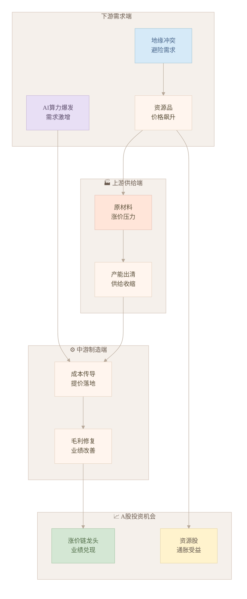

# Deep Research Framework

## Overview

The Deep Research skill provides a systematic approach to conducting thorough investigations on any topic. It combines multiple tools and methodologies to gather, analyze, verify, and synthesize information.

## Core Components

### 1. Research Planning
- Define research objectives
- Identify key questions
- Establish search criteria
- Determine validation requirements

### 2. Information Gathering
- Multi-source web search
- Content extraction from various formats
- Source diversity verification
- Temporal relevance assessment

### 3. Analysis & Synthesis
- Cross-reference multiple sources
- Identify patterns and contradictions
- Evaluate source credibility
- Organize findings systematically

### 4. Validation & Verification
- Fact-checking against authoritative sources
- Cross-validation of claims
- Identify potential biases
- Assess information reliability

## Research Workflow

### Phase 1: Initial Investigation
1. **Topic Analysis**
   - Clarify research scope
   - Identify key concepts and terms
   - Define specific questions to answer

2. **Broad Search**
   - Use `web_search` to identify major sources
   - Gather diverse perspectives
   - Map the landscape of available information

3. **Source Prioritization**
   - Rank sources by authority and relevance
   - Identify primary vs. secondary sources
   - Note publication dates and context

### Phase 2: Deep Dive
1. **Detailed Content Extraction**
   - Use `web_fetch` to retrieve full articles/pages
   - Extract key information systematically
   - Maintain source attribution

2. **Cross-Reference Analysis**
   - Compare claims across multiple sources
   - Identify agreements and disagreements
   - Note inconsistencies for further investigation

3. **Expert Sources**
   - Seek academic papers, expert opinions
   - Look for peer-reviewed sources
   - Identify recognized authorities on the topic

### Phase 3: Synthesis & Validation
1. **Pattern Recognition**
   - Identify consistent themes across sources
   - Highlight areas of disagreement
   - Note gaps in available information

2. **Fact Verification**
   - Cross-check claims against authoritative sources
   - Verify dates, statistics, and attributions
   - Identify potential misinformation

3. **Bias Assessment**
   - Evaluate source objectivity
   - Identify potential conflicts of interest
   - Consider temporal context of information

### Phase 4: Report Generation — ⚠️ MANDATORY POLISHER + VISUALIZATION STEP
> **⚠️ CRITICAL — Two mandatory steps before final output:**
> 1. **report-polisher-zh 研报润色** — MUST run before Mermaid conversion
> 2. **Mermaid 可视化** — ASCII diagrams MUST be converted to Mermaid
> Both steps are mandatory. Do not skip.

---

#### Step 1: report-polisher-zh 研报润色（必须在 Mermaid 之前执行）

在生成 Mermaid 图表之前，先对报告全文进行专业研报润色与 AI 痕迹清除。具体流程：

1. **加载 report-polisher-zh skill**：读取 `~/.qclaw/workspace/skills/report-polisher-zh/SKILL.md`
2. **研报结构检查**（按清单逐项核查）：
   - 标题规范性（含公司/行业名称、核心观点或投资评级）
   - 摘要完整性（核心逻辑、关键数据、投资建议）
   - 章节结构（行业概况、公司分析、财务分析、风险提示等）
   - 数据引用规范（来源标注、时间节点、数值单位统一）
   - 图表标注规范（编号连续、标题清晰、来源标注）
   - 风险提示完整性（主要风险、具体描述、风险等级）
3. **朱雀检测对抗三步法**（针对统计概率分布，非口语化）：
   - **术语注入**：用低频专业术语替代高频通俗词（"很多"→"众多"、"但是"→"然而"），使用行业特有表达（"赛道"、"估值锚"、"业绩兑现"）
   - **信息压缩**：提高信息密度，删除冗余修饰词，合并同类信息，每句话必须承载有效信息
   - **句式打散**：长短句极端混合，打破节奏规律性，避免"首先...其次...最后..."套路结构
4. **改写强度选择**（根据 AI 痕迹程度）：
   - 轻度（10-20%）：术语替换 + 句式微调
   - 中度（30-50%）：段落重组 + 信息压缩
   - 深度（60-80%）：结构重构 + 逻辑重排
5. **保留 Mermaid 代码块**：润色过程中**不修改** Mermaid 图表代码块，只处理文字描述部分

**⚠️ 无效方法（已验证失败，禁止使用）**：
- ❌ 口语化改写
- ❌ 情感注入
- ❌ 简单同义词替换
- ❌ 增加"我认为"等主观表达

**有效策略**：
- ✅ 术语注入
- ✅ 信息压缩
- ✅ 句式打散
- ✅ 适度瑕疵注入
- ✅ 个人表达习惯注入

> **⚠️ 注意**：研报润色和 Mermaid 优化是两个独立步骤。润色处理文字内容；Mermaid 优化处理图表。二者顺序不能颠倒。

---

When the research involves any of the following, you **MUST** invoke the `mermaid-diagrams` skill and convert ASCII/text diagrams into proper Mermaid syntax:
- 📊 **Architecture diagrams** (公司架构、业务结构、股权结构)
- 🔄 **Process flows** (业务流程、重整理赔流程、重组时间线)
- 🏢 **Organizational charts** (股权结构图、集团子公司关系图)
- 📈 **Market comparison tables** (竞争格局矩阵)
- 🔗 **Relationship diagrams** (供应链关系、上下游关系、概念股图谱)
- 📋 **Timeline diagrams** (发展历程、重大事件时间轴)

**Conversion rules (ASCII → Mermaid):**

| ASCII 类型 | Mermaid 类型 | 理由 |
|-----------|-------------|------|
| 树状/层级文本图 | `flowchart TD/LR` | 展示层级关系和决策路径 |
| 股权结构文字 | `flowchart TB` + 子图 `subgraph` | 清晰展示控制链 |
| 业务流程步骤 | `flowchart LR` + 决策节点 | 展示流程与分支 |
| 公司沿革时间线 | `flowchart LR` 或 `gantt` | 展示时间序列 |
| 竞争格局对比 | `quadrantChart` 或表格 | 不适合 Mermaid → 保留 Markdown 表格 |
| 架构分层图 | `C4` diagram 或 `flowchart` | 系统/业务架构 |

**⚠️ 关键约束（Mermaid 图表规则）：**
1. 节点数 ≤ 15 个（超出则拆分为多个图）
2. 每条连线必须有文字标签
3. 必须有标题/图注
4. 禁止用 Mermaid 画数据图表（柱状图/折线图等）
5. 产出为 `.mmd` 文件或嵌入 Markdown 的 Mermaid 代码块

**🎨 公众号风格配置（柔和马卡龙版）—— 强制应用**

所有 Mermaid 图表必须使用以下配置，确保颜色温柔、排版舒展，完全适配公众号阅读体验：

```mermaid
%%{init: {
  'theme': 'base',
  'themeVariables': {
    'primaryColor': '#FFE5D9',
    'primaryTextColor': '#5D4E37',
    'primaryBorderColor': '#E8C4B8',
    'lineColor': '#B8A99A',
    'secondaryColor': '#D4E7D4',
    'secondaryTextColor': '#4A6741',
    'secondaryBorderColor': '#A8C8A8',
    'tertiaryColor': '#E8DFF5',
    'tertiaryTextColor': '#5D4E6D',
    'tertiaryBorderColor': '#C8B8D8',
    'background': '#FFFBF5',
    'mainBkg': '#FFF5EE',
    'nodeBorder': '#E8D5C4',
    'clusterBkg': '#F5F0EB',
    'clusterBorder': '#D4C4B8',
    'titleColor': '#6B5B4F',
    'edgeLabelBackground': '#FFF9F0',
    'fontFamily': 'PingFang SC, Microsoft YaHei, sans-serif',
    'fontSize': '15px'
  },
  'flowchart': {
    'curve': 'basis',
    'padding': 20,
    'nodeSpacing': 50,
    'rankSpacing': 80,
    'diagramPadding': 30
  }
}}%%
```

**马卡龙色板（节点专用）：**

| 色块 | 色值 | 适用场景 |
|------|------|---------|
| 🍑 蜜桃粉 | `#FFE5D9` | 核心节点、重要结论 |
| 🌿 抹茶绿 | `#D4E7D4` | 产业链上游、供给端 |
| 💜 薰衣紫 | `#E8DFF5` | 科技创新、AI相关 |
| 🍋 柠檬黄 | `#FFF3CD` | 数据指标、业绩表现 |
| 🌊 天空蓝 | `#D6EAF8` | 需求端、下游应用 |
| 🌸 樱花粉 | `#FADBD8` | 风险提示、负面因素 |

**公众号适配排版规范：**
1. **节点文字**：中文优先，单节点≤20字，分行显示
2. **连线标签**：必须添加，说明关系（如"驱动"、"传导"、"受益"）
3. **子图分组**：使用 `subgraph` 划分逻辑区域，背景色用 `#F8F4F0`
4. **整体布局**：优先 `TD`（上下）或 `LR`（左右），避免斜线交叉
5. **节点形状**：
   - 矩形 `[]` → 常规节点
   - 圆角 `()` → 起点/终点
   - 菱形 `{}` → 判断/决策
   - 圆柱 `[()]` → 数据库/存储

**Step-by-step conversion workflow:**

```
Step 1: 识别报告中的 ASCII 图/文字架构图
         ↓
Step 2: 判断最适合的 Mermaid 类型 (flowchart / C4 / gantt / etc.)
         ↓
Step 3: 读取 mermaid-diagrams skill 获取该类型的标准语法
         ↓
Step 4: 逐节点转换（节点 label 保持中文，≤ 40字符）
         ↓
Step 5: 验证 Mermaid 语法（无断行语法错误）
         ↓
Step 6: 嵌入 Markdown 报告（或输出独立 .mmd 文件）
```

**📋 公众号风格 Mermaid 示例（完整模板）：**



> **⚠️ 每个图表开头必须包含完整的 `%%{init: {...}}%%` 配置块，否则无法应用马卡龙风格。**

**Phase 4 完整输出清单：**
1. ✅ **Humanizer-zh 去AI化**（文字内容已去AI味，保留 Mermaid 代码块）
2. ✅ Executive Summary（执行摘要，2-3句，人性化表达）
3. ✅ Mermaid 可视化图表（所有 ASCII 架构图已转换）
4. ✅ Structured findings（按主题组织，去AI化）
5. ✅ Source evaluation（来源可信度评估）
6. ✅ Limitations（研究局限性，去AI化）
7. ✅ Remaining questions（待深入研究的问题）

#### 1. Structured Summary
   - Executive summary of key findings
   - Detailed findings organized by theme
   - Supporting evidence for each claim

#### 2. Mermaid Visualization (MANDATORY)
   - Convert ALL ASCII/text architecture diagrams to Mermaid
   - Include at minimum: corporate structure, business overview, key timelines
   - Use appropriate diagram type per content (see conversion table above)

#### 3. Source Evaluation
   - Assessment of source credibility
   - Identification of limitations
   - Confidence levels for different claims

#### 4. Remaining Questions
   - Areas requiring further investigation
   - Conflicting information needing resolution
   - Gaps in current knowledge

## Tools Integration

### Web Research
- `web_search`: Initial broad search to identify sources
- `web_fetch`: Retrieve detailed content from specific URLs
- `browser`: For complex sites or when web_fetch fails

### Content Processing
- `read`: Process downloaded content or documents
- `write`: Create structured research notes
- `edit`: Refine and organize findings

### Mermaid Visualization (MANDATORY — Phase 4)
> **⚠️ Use `mermaid-diagrams` skill for ALL diagram generation.**
> ASCII diagrams in reports are a quality failure. Every architecture,
> process, or relationship diagram must be rendered as proper Mermaid.
- `mermaid-diagrams` skill: Read the skill file to get standard syntax for
  `flowchart`, `C4`, `gantt`, `sequenceDiagram`, `classDiagram`, `erDiagram`
- Output: `.mmd` files or `mermaid` code blocks embedded in Markdown
- See Phase 4 rules for node count limit (≤ 15), labeling rules, and type selection

**🎨 公众号风格（强制应用）：**
- 所有图表必须使用 **马卡龙色系**（蜜桃粉 `#FFE5D9`、抹茶绿 `#D4E7D4`、薰衣紫 `#E8DFF5` 等）
- 配置块 `%%{init: {...}}%%` 必须置于图表最开头
- 字体：`PingFang SC, Microsoft YaHei, sans-serif`，字号 15px
- 布局舒展：`nodeSpacing: 50`, `rankSpacing: 80`, `padding: 20`
- 节点分行显示，连线必须有中文标签

### Memory & Organization
- `memory_get` / `memory_search`: Reference previous research
- `write`: Create persistent research records
- Structured file organization for findings

## Research Quality Standards

### Source Diversity
- Include multiple perspectives on controversial topics
- Balance popular and academic sources
- Include international viewpoints when relevant
- Seek primary sources when possible

### Temporal Relevance
- Prioritize recent information for fast-changing topics
- Consider historical context for trend analysis
- Note when information was published
- Flag potentially outdated information

### Authority Assessment
- Prioritize peer-reviewed academic sources
- Consider author credentials and institutional affiliation
- Check for potential conflicts of interest
- Verify organizational reputation

## Iterative Research Approach

### Cycle 1: General Overview
- Broad search to understand the topic landscape
- Identify key terms, concepts, and stakeholders
- Establish initial research questions

### Cycle 2: Focused Investigation
- Targeted searches based on initial findings
- Deep dive into specific aspects
- Begin synthesis of information

### Cycle 3: Validation & Refinement
- Verify key claims across multiple sources
- Resolve contradictions
- Refine understanding based on evidence

### Cycle 4: Synthesis & Reporting
- Combine findings into coherent narrative
- **🔴 Humanizer-zh 去AI化（MUST run before Mermaid, text content only）**
- **🔴 Convert ALL ASCII diagrams to Mermaid (mermaid-diagrams skill is MANDATORY)**
- Identify remaining uncertainties
- Prepare final research report
- **Quality gate: (1) Has text been humanized? (2) Does the report contain any ASCII art/box diagrams that should be Mermaid?**

## Output Structure

### Research Report Template
```
# [Research Topic] - Deep Research Report

> **研报润色说明**：本报告已通过 report-polisher-zh 润色，文字表达符合专业研报规范，
> Mermaid 图表代码块在润色过程中已保留原样。

## Executive Summary
[2-3 sentence summary of key findings — humanized, natural tone]

## Research Questions
[Specific questions investigated]

## Methodology
[Description of research approach and tools used]

## Key Findings
[Main discoveries organized by theme — humanized language]

## [REQUIRED] Mermaid Visualizations
[Convert all ASCII diagrams to Mermaid code blocks.
 At minimum include: corporate structure, business overview, key event timeline.
 Mermaid code blocks go in this section. See Phase 4 Mermaid rules.]

## Supporting Evidence
[Evidence supporting each finding with sources]

## Contradictions/Debates
[Areas of disagreement among sources]

## Source Credibility Assessment
[Evaluation of information sources]

## Limitations
[Identified limitations in research — humanized language]

## Further Research Needed
[Questions requiring additional investigation]
```

> **⚠️ REMINDER: Before finalizing the report:**
> 1. **ALWAYS invoke `report-polisher-zh` skill** and polish text content first (preserve Mermaid code blocks)
> 2. **THEN invoke `mermaid-diagrams` skill** and convert any ASCII/text architecture diagrams to proper Mermaid syntax.
> See Phase 4 → report-polisher-zh + Mermaid Visualization sections for full rules.

## Use Cases

### Academic Research
- Literature reviews
- Topic exploration
- Source verification

### Business Intelligence
- Market analysis
- Competitive research
- Technology trends

### Fact Checking
- Claim verification
- Misinformation identification
- Source credibility assessment

### Personal Learning
- Deep topic exploration
- Concept clarification
- Question resolution

## Quality Assurance

- Always verify critical claims against multiple sources
- Flag information that seems unreliable
- Maintain skepticism toward sensational claims
- Prioritize authoritative sources over anonymous ones
- Document all sources for verification purposes