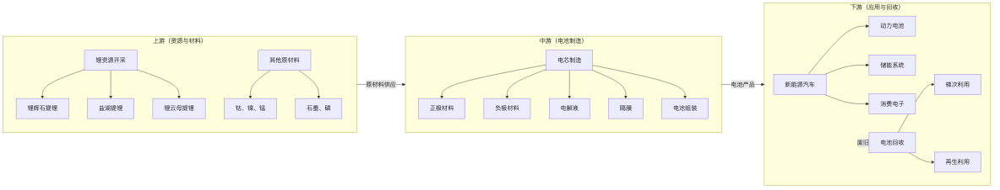
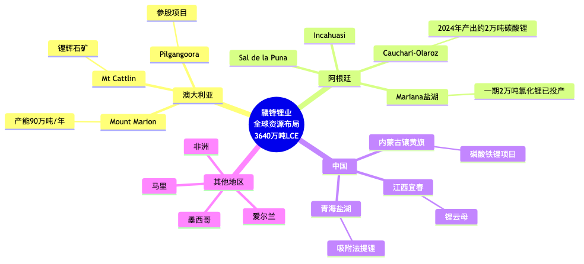
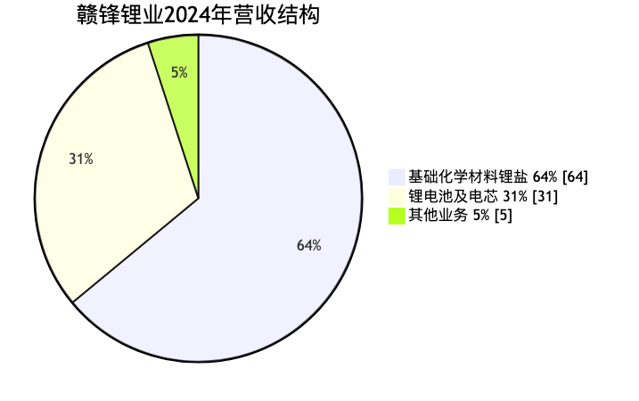
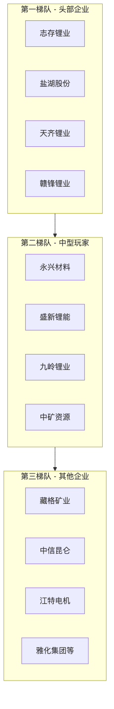
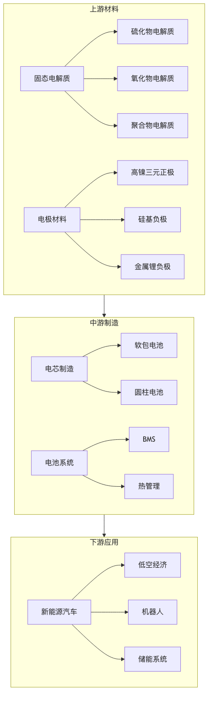
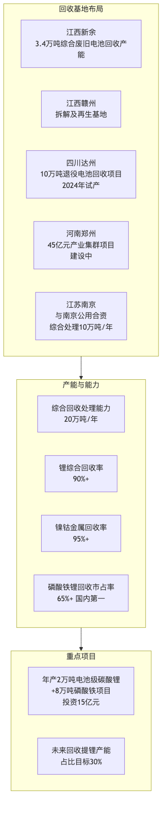
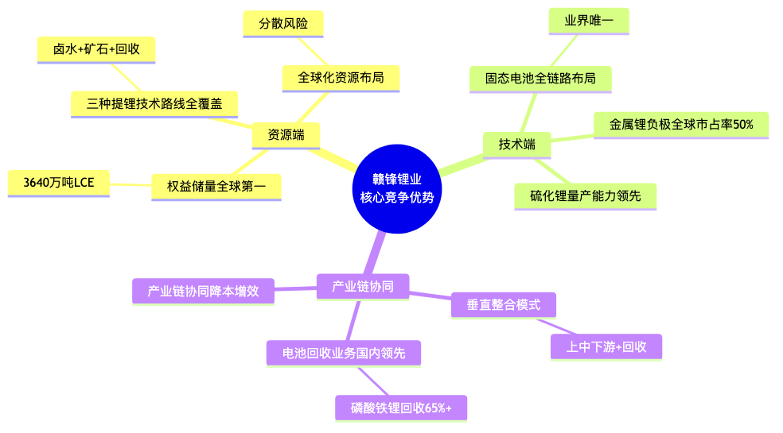

# 赣锋锂业所在锂电细分领域深度研究报告

> **报告生成时间：** 2026年3月29日

---

## 目录

- [执行摘要](#执行摘要)
- [一、锂电池产业链全景](#一锂电池产业链全景)
- [二、上游锂资源开发](#二上游锂资源开发)
- [三、中游锂盐深加工](#三中游锂盐深加工)
- [四、竞争格局分析](#四竞争格局分析)
- [五、固态电池：战略前瞻布局](#五固态电池战略前瞻布局)
- [六、锂电池回收：循环经济闭环](#六锂电池回收循环经济闭环)
- [七、风险因素分析](#七风险因素分析)
- [八、投资价值评估](#八投资价值评估)
- [九、研究结论](#九研究结论)
- [十、信息来源](#十信息来源)

---

## 执行摘要

赣锋锂业是全球锂行业唯一同时拥有「卤水提锂」「矿石提锂」和「回收提锂」三种产业化技术的企业，已形成**垂直整合的全产业链布局**。

公司核心定位为**上游锂资源开发 + 中游锂盐加工**，并向下延伸至锂电池制造与回收，构建了完整的产业闭环。

### 核心数据一览

| 指标 | 数值 | 行业地位 |
| --- | --- | --- |
| 全球锂矿权益储量 | 3640万吨LCE | **世界第一** |
| 2025年锂盐产能 | 33万吨LCE | 全球前三 |
| 2024年锂盐产量 | 13.03万吨LCE | — |
| 金属锂全球市占率 | 50% | **全球第一** |
| 磷酸铁锂回收市占率 | 65%+ | **国内第一** |
| 全球锂业市场份额 | 约16% | 全球第三 |

---

## 一、锂电池产业链全景

### 1.1 产业链结构图谱

### 1.2 赣锋锂业的产业链定位

| 环节 | 赣锋锂业布局 | 行业地位 |
| --- | --- | --- |
| **上游-锂资源** | 全球锂矿权益储量3640万吨LCE | **世界第一** |
| **中游-锂盐加工** | 2025年锂盐产能33万吨LCE | 全球前三 |
| **下游-锂电池** | 消费电池、动力/储能电池、固态电池 | 国内领先 |
| **循环-电池回收** | 综合回收能力20万吨/年 | **磷酸铁锂回收市占率65%+** |

---

## 二、上游锂资源开发

### 2.1 三大提锂技术路线对比

| 技术路线 | 原理 | 优势 | 劣势 | 赣锋布局 |
| --- | --- | --- | --- | --- |
| **锂辉石提锂** | 硫酸焙烧法，高温煅烧后酸化 | 品质最高、工艺成熟 | 依赖进口矿、成本较高 | 澳洲Mount Marion（90万吨/年） |
| **盐湖提锂** | 吸附法/膜法/沉淀法 | 成本低、储量占全球60%+ | 周期长、受气候影响 | 阿根廷Mariana、Cauchari-Olaroz |
| **锂云母提锂** | 硫酸盐法 | 中国资源丰富、可副产铷铯 | 品位低、成本高 | 江西宜春云母矿 |

### 2.2 赣锋锂业全球资源布局

### 2.3 关键运营数据

| 指标 | 数据 |
| --- | --- |
| 2025年锂矿自给率 | 预计超50% |
| 全球锂盐年产能 | 超30万吨LCE |
| 2024年锂盐产量 | 13.03万吨LCE |
| 2024年锂盐销量 | 12.97万吨LCE |

---

## 三、中游锂盐深加工

### 3.1 主要产品矩阵

| 产品 | 用途 | 产能/产量 | 市场地位 |
| --- | --- | --- | --- |
| 电池级碳酸锂 | 动力电池正极材料 | 主力产品 | 全球最大供应商之一 |
| 电池级氢氧化锂 | 高镍三元电池 | 产能持续扩张 | 宁德时代、LG等核心供应商 |
| 金属锂 | 固态电池负极、医药 | 年产能2000吨 | **全球市占率50%** |
| 丁基锂 | 有机合成催化剂 | 产能500吨/年 | 细分领域龙头 |
| 氟化锂 | 陶瓷、玻璃 | 产能1500吨/年 | — |

### 3.2 营收结构（2024年）

| 业务板块 | 占比 | 主要内容 | 营收 |
| --- | ---: | --- | --- |
| 基础化学材料（锂盐） | 64% | 碳酸锂、氢氧化锂为主 | 约120.17亿元 |
| 锂电池及电芯 | 31% | 动力储能电池产量11.4GWh | 58.97亿元 |
| 其他业务 | 5% | 其他产品与服务 | — |

---

## 四、竞争格局分析

### 4.1 全球锂业市场份额

根据国泰君安证券研究，全球77%的锂业市场份额由五大公司掌控：

| 排名 | 企业 | 市场份额 | 总部 |
| ---: | --- | --- | --- |
| 1 | 美国雅宝 (ALB) | 25% | 美国 |
| 2 | 智利矿业化工 (SQM) | 15% | 智利 |
| 3 | **赣锋锂业** | **16%** | 中国 |
| 4 | **天齐锂业** | **14%** | 中国 |
| 5 | 美国Livent | 7% | 美国 |

### 4.2 中国锂矿双雄对比

#### 赣锋锂业 vs 天齐锂业

| 维度 | 赣锋锂业 | 天齐锂业 | 评价 |
| --- | --- | --- | --- |
| **权益储量** | 3640万吨LCE | 1614万吨LCE | 赣锋规模更大 |
| **资源质量** | 多元化，品位参差 | 格林布什矿品位最高（1.9%） | 天齐品质更优 |
| **锂矿自给率** | 约50% | 接近100% | 天齐成本优势明显 |
| **产业链布局** | 全产业链（上中下游+回收） | 以上游为主 | 赣锋更全面 |
| **固态电池** | 全链路布局，商业化领先 | 无显著布局 | 赣锋前瞻布局 |
| **电池回收** | 磷酸铁锂回收市占率65%+ | 无显著布局 | 赣锋独家优势 |
| **技术路线** | 卤水+矿石+回收三路线 | 以矿石为主 | 赣锋技术多元 |

#### 核心差异分析

- **天齐锂业**：资源质量更优，成本控制能力更强，盈利能力更稳定
- **赣锋锂业**：产业链更完整，技术路线更多元，前瞻布局固态电池与回收

### 4.3 国内竞争格局

---

## 五、固态电池：战略前瞻布局

### 5.1 固态电池产业链结构

### 5.2 赣锋锂业固态电池全链路布局

> **业界唯一打通固态电池全产业链的企业**

| 环节 | 布局内容 | 进展 |
| --- | --- | --- |
| **硫化锂原料** | 2022年量产，2024年扩产 | 纯度99.9%，粒径D50≤5μm，已向20+客户供货 |
| **固态电解质** | 硫化物+氧化物双路线 | 硫化物电解质电导率突破3mS/cm |
| **金属锂负极** | 3微米超薄锂带 | **全球市占率50%**，年产能2000吨 |
| **电芯制造** | 320-550Wh/kg产品梯度 | 500Wh/kg产品已小批量量产 |
| **电池系统** | 低空飞行器电源 | 已与无人机、eVTOL企业合作 |

### 5.3 技术突破与性能指标

| 指标 | 赣锋锂业水平 | 行业意义 |
| --- | --- | --- |
| 能量密度 | 500Wh/kg（小批量量产） | 全球首款达到此水平的量产产品 |
| 循环寿命 | 400Wh/kg电芯突破800次 | 具备规模化应用潜力 |
| 硅基体系 | 320-450Wh/kg梯度布局 | 320Wh/kg电芯循环突破1000次 |
| 商业化 | 与国际头部车企联合开发 | 装车验证推进中 |

### 5.4 固态电池市场前景

| 时间节点 | 预测出货量 | 渗透率 | 市场规模 |
| --- | --- | --- | --- |
| 2025年 | 11.1 GWh | 约1% | 约50亿元 |
| 2030年 | 614.1 GWh | 约10% | 超2500亿元 |

> **赣锋锂业竞争优势**：作为唯一具备固态电池全链路能力的企业，将充分受益于固态电池产业化进程。

---

## 六、锂电池回收：循环经济闭环

### 6.1 回收业务布局

### 6.2 战略意义

| 维度 | 价值说明 |
| --- | --- |
| **资源安全** | 减少对进口锂矿依赖，构建「城市矿山」 |
| **成本控制** | 回收提锂成本低于矿石提锂 |
| **环保合规** | 符合欧盟电池法规回收要求 |
| **产业链闭环** | 实现「资源-产品-回收-再利用」循环 |
| **ESG价值** | 降低碳排放，提升可持续发展评级 |

---

## 七、风险因素分析

### 7.1 行业风险

| 风险类型 | 具体表现 | 影响程度 |
| --- | --- | ---: |
| **锂价波动** | 碳酸锂价格从2022年60万元/吨跌至2024年10万元/吨 | ⭐⭐⭐ 高 |
| **产能过剩** | 2024年全球锂盐产能过剩，行业进入去库存周期 | ⭐⭐⭐ 高 |
| **技术迭代** | 钠电池等替代技术可能冲击锂电池市场 | ⭐⭐ 中 |
| **地缘政治** | 澳洲、南美资源出口政策风险 | ⭐⭐ 中 |

### 7.2 公司特有风险

| 风险类型 | 具体表现 |
| --- | --- |
| **资源品位** | 赣锋资源储量虽大，但品位不如天齐的格林布什矿 |
| **自给率不足** | 2024年锂矿自给率约50%，原料成本承压 |
| **固态电池商业化** | 技术领先但大规模商业化仍需时间验证 |
| **财务压力** | 2024年遭遇上市以来首亏，盈利能力承压 |

---

## 八、投资价值评估

### 8.1 核心竞争优势（护城河分析）

### 8.2 成长驱动力

| 驱动因素 | 时间维度 |
| --- | --- |
| 锂价周期回暖 | 短期（2025-2026） |
| 固态电池商业化加速 | 中期（2025-2028） |
| 电池回收放量 | 中长期（2025-2030） |
| 新能源汽车与储能需求增长 | 长期 |

### 8.3 与天齐锂业的投资逻辑差异

| 维度 | 赣锋锂业 | 天齐锂业 |
| --- | --- | --- |
| **投资逻辑** | 成长 + 转型 | 价值 + 周期 |
| **核心看点** | 固态电池、电池回收、全产业链 | 资源品质、成本优势、盈利稳定性 |
| **风险收益特征** | 高弹性、高成长 | 高确定性、高分红潜力 |
| **适合投资者** | 看好固态电池前景、愿意承担更高波动 | 追求稳健收益、看好锂价周期 |

---

## 九、研究结论

### 9.1 核心发现

1. **产业链定位**  
   赣锋锂业是**锂电上游资源开发 + 中游锂盐加工**的核心企业，同时向下延伸至电池制造与回收，形成垂直整合模式。

2. **竞争地位**  
   全球锂业市场份额约16%，权益储量全球第一，是**中国锂矿双雄之一**。

3. **核心优势**
   - 三种提锂技术路线全覆盖（卤水 + 矿石 + 回收）
   - 固态电池全链路布局（业界唯一）
   - 电池回收业务国内领先（磷酸铁锂回收市占率65%+）

4. **差异化竞争**  
   与天齐锂业相比，赣锋更注重**产业链完整性**和**技术前瞻布局**，在固态电池和回收领域建立了独特壁垒。

5. **成长潜力**  
   固态电池产业化进程将显著受益，电池回收业务将成为重要增长点。

### 9.2 待进一步研究的问题

1. 固态电池大规模商业化的时间节点与成本曲线？
2. 电池回收业务的盈利模型与市场竞争格局演变？
3. 锂价周期拐点的判断依据？
4. 钠电池等替代技术对锂电池市场的实际冲击程度？

---

## 十、信息来源

### 公司层面

- 赣锋锂业2024年年度报告
- 赣锋锂业投资者关系活动记录表
- 公司公告与官方披露

### 行业研究

- 国泰君安证券研究报告
- 长江证券研究所数据
- 中商产业研究院报告
- 前瞻产业研究院分析

### 新闻资讯

- 新浪财经、今日头条、雪球等财经媒体
- 行业垂直媒体（国际储能网、我的钢铁网等）

---

> **免责声明**：本报告仅供参考，不构成投资建议。投资者应独立判断，自行承担投资风险。
